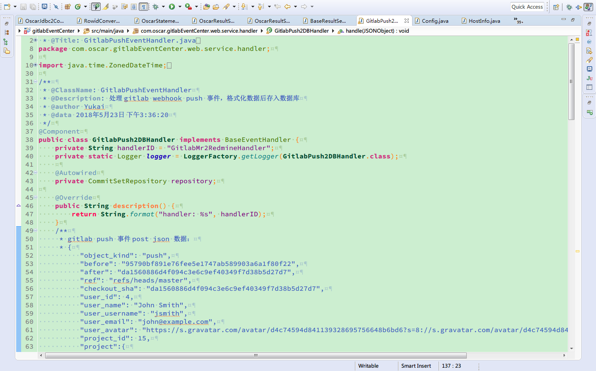

## Eclipse 配置

### install

备份 `your workspace\.metadata\.plugins\org.eclipse.core.runtime` 目录下 .setting 文件夹；

将 .setting 文件夹拷贝至 `your workspace\.metadata\.plugins\org.eclipse.core.runtime` 目录下，覆盖原有的设置

### demo

